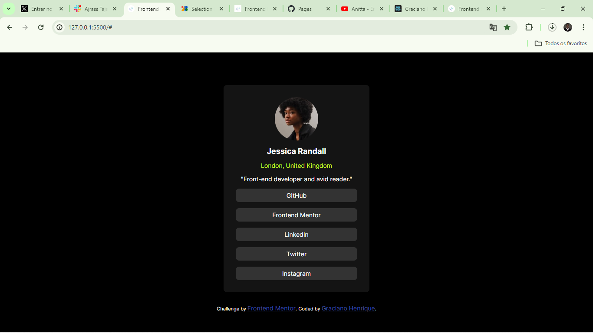

# Frontend Mentor - Social links profile solution

This is a solution to the [Social links profile challenge on Frontend Mentor](https://www.frontendmentor.io/challenges/social-links-profile-UG32l9m6dQ). Frontend Mentor challenges help you improve your coding skills by building realistic projects. 

## Table of contents

- [Overview](#overview)
  - [The challenge](#the-challenge)
  - [Screenshot](#screenshot)
  - [Links](#links)
- [My process](#my-process)
  - [Built with](#built-with)
  - [What I learned](#what-i-learned)
  - [Continued development](#continued-development)
  - [Useful resources](#useful-resources)
- [Author](#author)
- [Acknowledgments](#acknowledgments)


## Overview

### The challenge

Users should be able to:

- See hover and focus states for all interactive elements on the page

### Screenshot




### Links

- Solution URL: [solution URL](https://github.com/Graciano1997/social_link_profile/)
- Live Site URL: [live site URL](https://graciano1997.github.io/social_link_profile/)

## My process

### Built with

- Semantic HTML5 markup
- CSS custom properties
- Flexbox
- Mobile-first workflow


### What I learned

I recap the display flex.

To see how you can add code snippets, see below:

```html
<nav class="linkNavContainer">
<a href="#">GitHub</a>
<a href="#">Frontend Mentor</a>
<a href="#">LinkedIn</a>
<a href="#">Twitter</a>
<a href="#">Instagram</a>
</nav>
```
```css
.linkNavContainer a{
    background-color: hsl(0, 0%, 20%);
    color: white;
    padding: 0.5rem;
    text-decoration: none;
    border-radius: 8px;
    text-align: center;
}
a:active{
    background-color: hsl(75, 94%, 57%);
    color: black;
}
```


### Continued development

**Tailwind and other CSS framework**

### Useful resources

- [Microverse](https://microverse.org/) - This helped me with the Full Stack Development Program.

## Author

- Website - [Graciano Henrique Portfolio](https://portofolio-graciano.vercel.app/)
- Frontend Mentor - [@Graciano1997](https://www.frontendmentor.io/profile/Graciano1997)
- Twitter - [@GracianoSoft](https://www.twitter.com/Gracianosoft)

## Acknowledgments

- Microverse
- FrontEnd Mentor